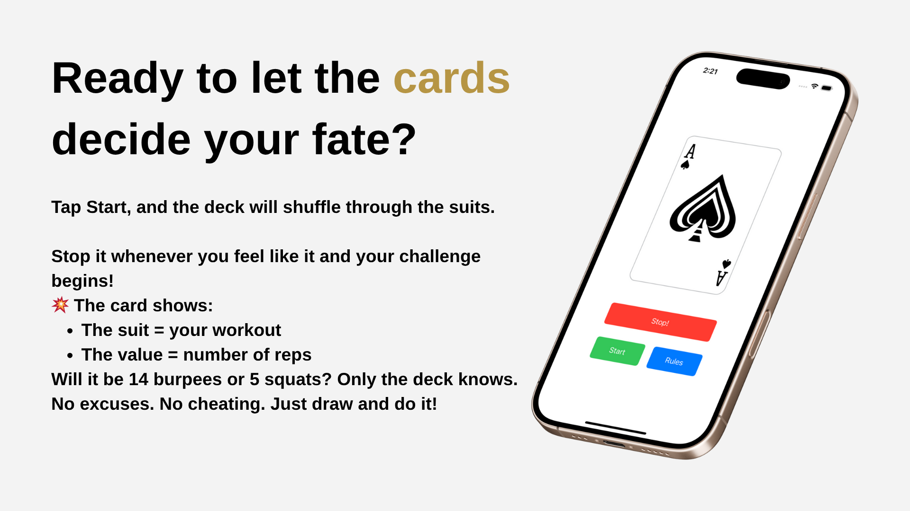
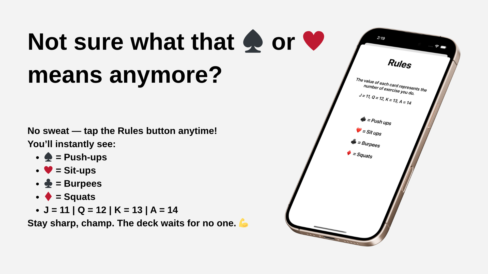

# 🃏 DeckFit – The Card-Based Fitness Challenge App

**Let the cards decide your next move!**  
DeckFit turns a standard deck of cards into a full-body workout. No equipment needed — just shuffle, draw, and **sweat it out**.

---

## 📱 App Preview

### 🔥 Introduction

### 💪 How It Works

### 📜 Rules at a Glance

---

## 🚀 How to Use

1. **Tap START** – The app will shuffle and pick a random card.
2. **Check the Card** – The card will show:
   - **Suit = Workout Type**
   - **Card Value = Number of Reps**
3. **Complete the Challenge** – Do the exercise shown!
4. **Ready for more?** Tap again and keep the grind going!

### 💡 Suit to Workout Mapping
| Suit   | Exercise |
|--------|----------|
| ♠️ Spades   | Push-ups |
| ♥️ Hearts   | Sit-ups  |
| ♣️ Clubs    | Burpees  |
| ♦️ Diamonds | Squats   |

### 🂡 Card Values
| Card | Reps |
|------|------|
| J    | 11   |
| Q    | 12   |
| K    | 13   |
| A    | 14   |

---

## ❓ Forgot the Rules?

Just tap the **"Rules"** button in the app at any time to see what each suit and card means. Stay focused and keep pushing!

---

## ⚙️ Built With

- Swift & UIKit
- Xcode
- Core Animation

---

## 💬 Feedback

Have a feature request or found a bug? Drop an issue or pull request — we'd love to hear from you!

---

**Ready to turn your workout into a game?**  
👉 Download DeckFit now and let the cards lead the way!
